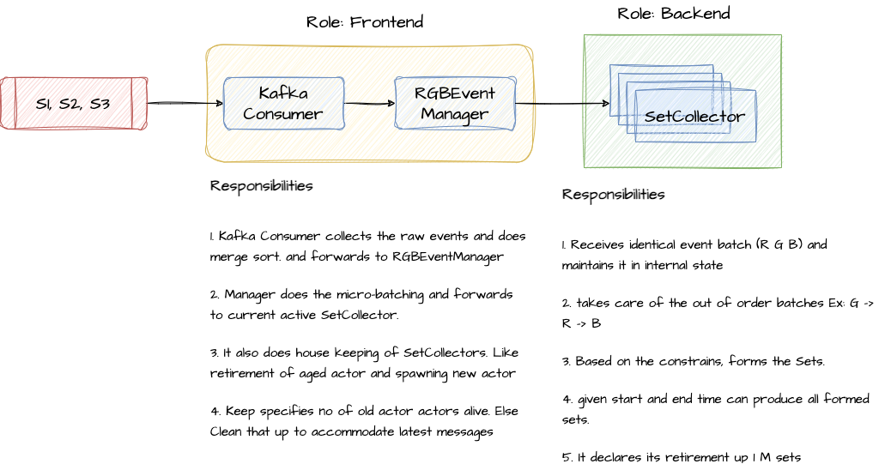
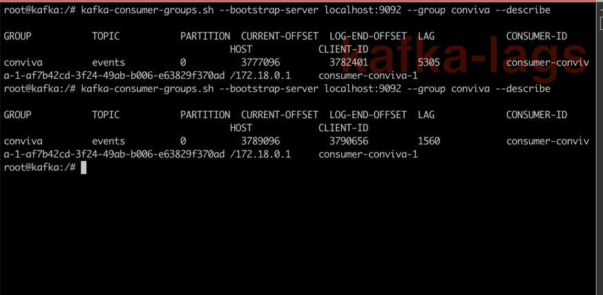
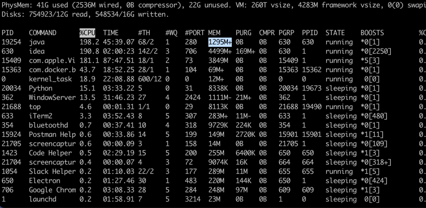

# Problem Statement:


# Solution Proposed



## FrontEnd:

#### Responsible for
- consuming messages from Kafka
- orders all message by time
- micro-batch it by Category (RGB)
- forward it to backend for set preparation
- receives RetirementRequest from current serving SetCollector
- Firstly the SetCollector is moved to old collectors (data still available in memory)
- Creates new SetCollector, now it is responsible for forming sets
- RGB manager prunes aged actor based on configuration. ex: keep 10 aged actor. if 11th added to agedList. remove 1st.
- so it is based on user to decide how many data to keep.
- across actor query coordination. Ex: given start, end time could be spanned across multiple actors. it takes care of 
- coordinating and producing the results. 

## Backend 
#### - one active backend at a time

- receives batch of sorted events by manager
- fills red 
- if any out of order events (G, B -> before R or B before G), buffers it and forms sets later the required event arrived.
- fills green and blue based on condition
- for given time range - does binary search and returns the result.
- if max no of sets served, requests for retirement

## Lets get the hands dirty:

To run the unit testing

```sh
sbt test
```
To run the app

```sh
docker compose up -d
```

To trigger the data ingetstion

```sh
python3 scripts/producer.py
```

To get the status if the sets collected 

```sh
curl --location 'http://localhost:8080/events/get-stats'
```

## Benchmarks

1. Ran with 3 million records, the aging policy kicks in as per config.
2. there was no OOM - it handled the load well.



After 3M - the memory was around 1.2G and 3 actors. 2 of them are aged actors. If our limitation 1.5G. Then the max
aged actor can be set to = 2. so it evicts 1 3rd of max memory everytime it reaches ~80% util. 



## Future Work

#### - Clustered approach to scale out the backend. so we can accommodate more in-memory data across multiple machines. 