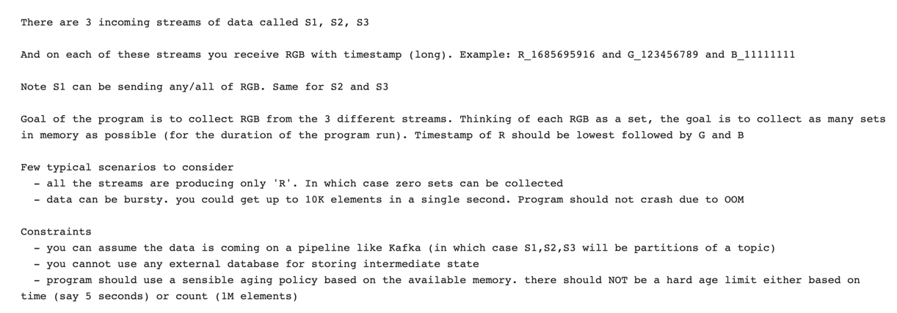

# Problem Statement:

# Solution Proposed

## FrontEnd:

#### Responsible for
- consuming messages from Kafka
- orders all message by time
- micro-batch it by Category (RGB)
- forward it to backend for set preparation

#### Example
Kafka partitions s1, s2, s3 (produces R, G, B) ---> 3 sources are merge sorted by time stamp
get the total pairs
time query if possible

## Backend 
#### - one active backend at a time

receives batch of sorted events by manager
fills red
fills green and blue based on condition
binary search